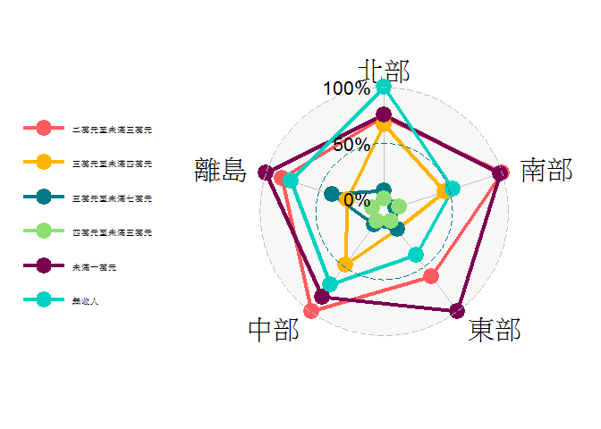
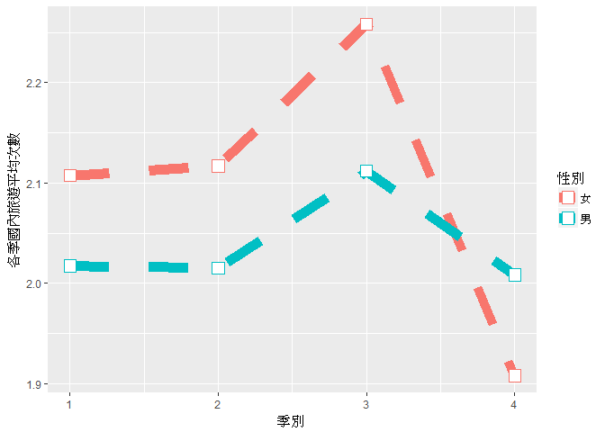
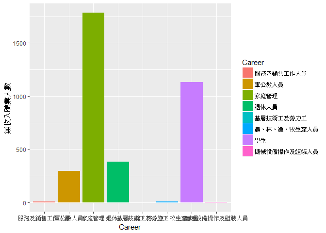
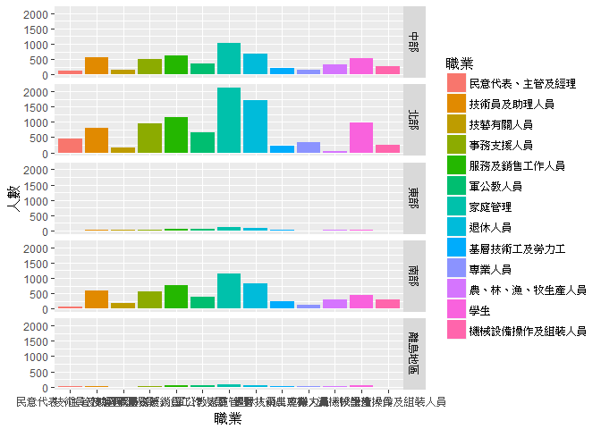
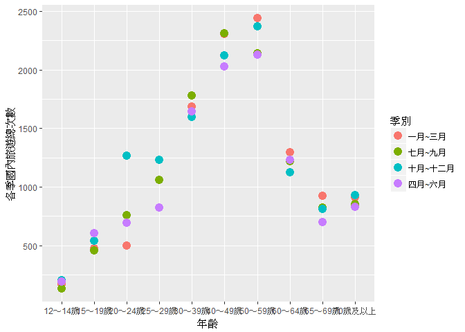
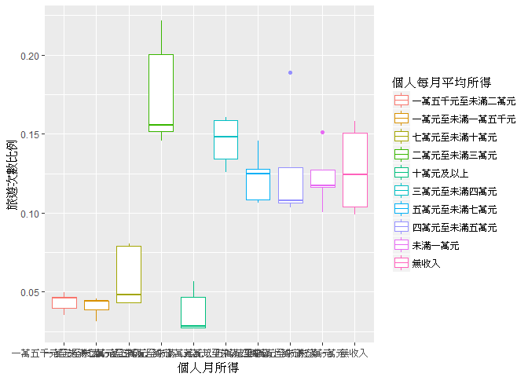
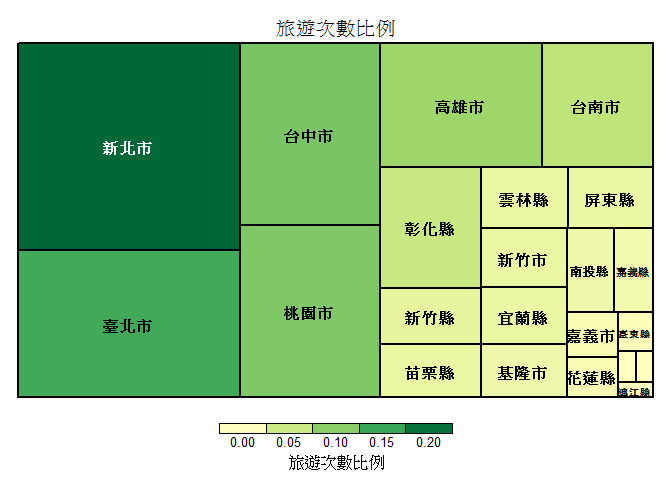

長庚大學 大數據分析方法 作業六
================

國內旅遊人數分析
----------------

組員姓名:李旻臻、毛臆菱

分析議題背景
------------

一個國家觀光業的發展通常對於國際與國內總體環境的變化具有高程度的敏感性， 所以觀光業已成為國家與地方經濟發展的重要角色。

分析動機
--------

由於旅遊已成為大多數人的休閒活動之一，所以我們想了解旅遊次數是否和職業或月收入有交互影響的關係。並且更進一步分析年齡、季別和居住地區是否對旅遊次數有所影響。

使用資料
--------

政府資料開放平台 (104年國人旅遊狀況調查)

載入使用資料們

``` r
library(readr)
traveldata <- read.csv("C:/Users/Eileen/Desktop/taiwantravel.csv",fileEncoding ="Big5")
View(traveldata)
```

資料處理與清洗
--------------

step1 先將居住地區分類 step2 將分好的居住地區再細分個人每月平均所得 step3 藉由所得來觀察職業

在處理資料的過程中發現北部旅遊人數最多的所得竟然是無收入，所以我們在下面的圖表做了整個資料表無收入最多的職業是家庭管理 處理資料

``` r
library(knitr)
library(dplyr)
```

    ## Warning: Installed Rcpp (0.12.9) different from Rcpp used to build dplyr (0.12.11).
    ## Please reinstall dplyr to avoid random crashes or undefined behavior.

    ## 
    ## Attaching package: 'dplyr'

    ## The following objects are masked from 'package:stats':
    ## 
    ##     filter, lag

    ## The following objects are masked from 'package:base':
    ## 
    ##     intersect, setdiff, setequal, union

``` r
library(data.table)
```

    ## 
    ## Attaching package: 'data.table'

    ## The following objects are masked from 'package:dplyr':
    ## 
    ##     between, first, last

``` r
traveldatan <- traveldata[grepl("北部",traveldata$`居住地區`),] #北部旅遊的表單

normoney<-
  group_by(traveldatan,Revenue=`個人每月平均所得`) %>%
  summarise(`個人每月平均所得人數(北)`=n()) %>%
  arrange(desc(`個人每月平均所得人數(北)`)) #北部月所得旅遊表單
knitr::kable(normoney[1:10,])
```

| Revenue                | 個人每月平均所得人數(北) |
|:-----------------------|:------------------------:|
| 無收入                 |           1747           |
| 未滿一萬元             |           1547           |
| 二萬元至未滿三萬元     |           1528           |
| 三萬元至未滿四萬元     |           1469           |
| 五萬元至未滿七萬元     |            985           |
| 四萬元至未滿五萬元     |            921           |
| 一萬元至未滿一萬五千元 |            499           |
| 一萬五千元至未滿二萬元 |            498           |
| 七萬元至未滿十萬元     |            356           |
| 十萬元及以上           |            343           |

``` r
northmoneytd<-traveldatan[grepl("無收入",traveldatan$`個人每月平均所得`),] #北部旅遊無收入的表單

norjob<-
  group_by(northmoneytd,Career=`職業`) %>%
  summarise(`無收入職業人數(北)`=n()) %>%
  arrange(desc(`無收入職業人數(北)`)) #北部無收入職業旅遊表單
knitr::kable(norjob[1:7,])
```

| Career                 | 無收入職業人數(北) |
|:-----------------------|:------------------:|
| 家庭管理               |         839        |
| 學生                   |         546        |
| 退休人員               |         198        |
| 軍公教人員             |         158        |
| 服務及銷售工作人員     |          3         |
| 機械設備操作及組裝人員 |          2         |
| 農、林、漁、牧生產人員 |          1         |

``` r
northmoneyjobtd<-northmoneytd[grepl("家庭管理",northmoneytd$`職業`),]

norage<-
  group_by(northmoneyjobtd,Age=`年齡`) %>%
  summarise(`無收入家庭管理年齡人數(北)`=n()) %>%
  arrange(desc(`無收入家庭管理年齡人數(北)`)) #北部無收入家庭管理年齡旅遊表單
knitr::kable(norage[1:8,])
```

| Age        | 無收入家庭管理年齡人數(北) |
|:-----------|:--------------------------:|
| 50～59歲   |             239            |
| 60～64歲   |             192            |
| 40～49歲   |             149            |
| 30～39歲   |             109            |
| 65～69歲   |             75             |
| 70歲及以上 |             57             |
| 25～29歲   |             13             |
| 20～24歲   |              5             |

``` r
traveldatas <- traveldata[grepl("南部",traveldata$`居住地區`),] #南部旅遊的表單

soumoney<-
  group_by(traveldatas,Revenue=`個人每月平均所得`) %>%
  summarise(`個人每月平均所得人數(南)`=n()) %>%
  arrange(desc(`個人每月平均所得人數(南)`)) #南部月所得旅遊表單
knitr::kable(soumoney[1:10,])
```

| Revenue                | 個人每月平均所得人數(南) |
|:-----------------------|:------------------------:|
| 二萬元至未滿三萬元     |           1179           |
| 未滿一萬元             |           1164           |
| 無收入                 |            843           |
| 三萬元至未滿四萬元     |            789           |
| 四萬元至未滿五萬元     |            483           |
| 五萬元至未滿七萬元     |            460           |
| 一萬五千元至未滿二萬元 |            415           |
| 一萬元至未滿一萬五千元 |            350           |
| 七萬元至未滿十萬元     |            177           |
| 十萬元及以上           |            114           |

``` r
southmoneytd<-traveldatas[grepl("二萬元至未滿三萬元",traveldatas$`個人每月平均所得`),]

soujob<-
  group_by(southmoneytd,Career=`職業`) %>%
  summarise(`二萬元至未滿三萬元職業人數(南)`=n()) %>%
  arrange(desc(`二萬元至未滿三萬元職業人數(南)`)) #南部二萬~三萬職業旅遊表單
knitr::kable(soujob[1:13,])
```

| Career                 | 二萬元至未滿三萬元職業人數(南) |
|:-----------------------|:------------------------------:|
| 服務及銷售工作人員     |               278              |
| 事務支援人員           |               234              |
| 技術員及助理人員       |               144              |
| 機械設備操作及組裝人員 |               138              |
| 基層技術工及勞力工     |               96               |
| 退休人員               |               88               |
| 家庭管理               |               64               |
| 技藝有關人員           |               54               |
| 農、林、漁、牧生產人員 |               47               |
| 軍公教人員             |               20               |
| 專業人員               |               11               |
| 學生                   |                3               |
| 民意代表、主管及經理   |                2               |

``` r
southmoneyjobtd<-southmoneytd[grepl("服務及銷售工作人員",southmoneytd$`職業`),]

souage<-
  group_by(southmoneyjobtd,Age=`年齡`) %>%
  summarise(`二萬元至未滿三萬元服務及銷售工作人員年齡人數(南)`=n()) %>%
  arrange(desc(`二萬元至未滿三萬元服務及銷售工作人員年齡人數(南)`))
knitr::kable(souage[1:9,])
```

| Age        | 二萬元至未滿三萬元服務及銷售工作人員年齡人數(南) |
|:-----------|:------------------------------------------------:|
| 40～49歲   |                        65                        |
| 50～59歲   |                        51                        |
| 25～29歲   |                        45                        |
| 30～39歲   |                        45                        |
| 20～24歲   |                        32                        |
| 60～64歲   |                        20                        |
| 65～69歲   |                        11                        |
| 70歲及以上 |                         6                        |
| 15～19歲   |                         3                        |

``` r
#南部二萬~三萬服務及銷售工作人員年齡旅遊表單

traveldatae <- traveldata[grepl("東部",traveldata$`居住地區`),] #東部旅遊的表單

easmoney<-
  group_by(traveldatae,Revenue=`個人每月平均所得`) %>%
  summarise(`個人每月平均所得人數(東)`=n()) %>%
  arrange(desc(`個人每月平均所得人數(東)`)) #東部月所得旅遊表單
knitr::kable(easmoney[1:10,])
```

| Revenue                | 個人每月平均所得人數(東) |
|:-----------------------|:------------------------:|
| 未滿一萬元             |            107           |
| 二萬元至未滿三萬元     |            85            |
| 無收入                 |            72            |
| 三萬元至未滿四萬元     |            56            |
| 五萬元至未滿七萬元     |            56            |
| 四萬元至未滿五萬元     |            51            |
| 一萬元至未滿一萬五千元 |            35            |
| 一萬五千元至未滿二萬元 |            31            |
| 七萬元至未滿十萬元     |            21            |
| 十萬元及以上           |            14            |

``` r
eastmoneytd<-traveldatae[grepl("未滿一萬元",traveldatae$`個人每月平均所得`),]

easjob<-
  group_by(eastmoneytd,Career=`職業`) %>%
  summarise(`未滿一萬元職業人數(東)`=n()) %>%
  arrange(desc(`未滿一萬元職業人數(東)`))
knitr::kable(easjob[1:8,])
```

| Career                 | 未滿一萬元職業人數(東) |
|:-----------------------|:----------------------:|
| 家庭管理               |           36           |
| 退休人員               |           34           |
| 學生                   |           15           |
| 農、林、漁、牧生產人員 |           11           |
| 軍公教人員             |            5           |
| 服務及銷售工作人員     |            3           |
| 基層技術工及勞力工     |            2           |
| 技藝有關人員           |            1           |

``` r
eastmoneyjobtd<-eastmoneytd[grepl("家庭管理",eastmoneytd$`職業`),]

easage<-
  group_by(eastmoneyjobtd,Age=`年齡`) %>%
  summarise(`未滿一萬元家庭管理年齡人數(東)`=n()) %>%
  arrange(desc(`未滿一萬元家庭管理年齡人數(東)`))
knitr::kable(easage[1:6,])
```

| Age        | 未滿一萬元家庭管理年齡人數(東) |
|:-----------|:------------------------------:|
| 70歲及以上 |               19               |
| 60～64歲   |                6               |
| 50～59歲   |                4               |
| 65～69歲   |                3               |
| 30～39歲   |                2               |
| 40～49歲   |                2               |

``` r
traveldatam <- traveldata[grepl("中部",traveldata$`居住地區`),] #中部旅遊的表單

midmoney<-
  group_by(traveldatam,Revenue=`個人每月平均所得`) %>%
  summarise(`個人每月平均所得人數(中)`=n()) %>%
  arrange(desc(`個人每月平均所得人數(中)`)) #中部月所得旅遊表單
knitr::kable(midmoney[1:10,])
```

| Revenue                | 個人每月平均所得人數(中) |
|:-----------------------|:------------------------:|
| 二萬元至未滿三萬元     |           1096           |
| 未滿一萬元             |            985           |
| 無收入                 |            896           |
| 三萬元至未滿四萬元     |            746           |
| 五萬元至未滿七萬元     |            447           |
| 四萬元至未滿五萬元     |            422           |
| 一萬五千元至未滿二萬元 |            323           |
| 一萬元至未滿一萬五千元 |            323           |
| 七萬元至未滿十萬元     |            151           |
| 十萬元及以上           |            113           |

``` r
middlemoneytd<-traveldatam[grepl("二萬元至未滿三萬元",traveldatam$`個人每月平均所得`),]

midjob<-
  group_by(middlemoneytd,Career=`職業`) %>%
  summarise(`二萬元至未滿三萬元職業人數(中)`=n()) %>%
  arrange(desc(`二萬元至未滿三萬元職業人數(中)`))
knitr::kable(midjob[1:13,])
```

| Career                 | 二萬元至未滿三萬元職業人數(中) |
|:-----------------------|:------------------------------:|
| 服務及銷售工作人員     |               255              |
| 事務支援人員           |               209              |
| 技術員及助理人員       |               143              |
| 機械設備操作及組裝人員 |               116              |
| 退休人員               |               87               |
| 基層技術工及勞力工     |               82               |
| 家庭管理               |               73               |
| 技藝有關人員           |               45               |
| 農、林、漁、牧生產人員 |               31               |
| 軍公教人員             |               30               |
| 專業人員               |               11               |
| 民意代表、主管及經理   |                7               |
| 學生                   |                7               |

``` r
middlemoneyjobtd<-middlemoneytd[grepl("服務及銷售工作人員",middlemoneytd$`職業`),]

midage<-
  group_by(middlemoneyjobtd,Age=`年齡`) %>%
  summarise(`二萬元至未滿三萬元服務及銷售工作人員年齡人數(中)`=n()) %>%
  arrange(desc(`二萬元至未滿三萬元服務及銷售工作人員年齡人數(中)`))
knitr::kable(midage[1:9,])
```

| Age        | 二萬元至未滿三萬元服務及銷售工作人員年齡人數(中) |
|:-----------|:------------------------------------------------:|
| 50～59歲   |                        51                        |
| 30～39歲   |                        50                        |
| 40～49歲   |                        47                        |
| 25～29歲   |                        46                        |
| 20～24歲   |                        30                        |
| 60～64歲   |                        18                        |
| 65～69歲   |                         7                        |
| 15～19歲   |                         3                        |
| 70歲及以上 |                         3                        |

``` r
traveldatao <- traveldata[grepl("離島地區",traveldata$`居住地區`),] #離島旅遊的表單

outmoney<-
  group_by(traveldatao,Revenue=`個人每月平均所得`) %>%
  summarise(`個人每月平均所得人數(離島)`=n()) %>%
  arrange(desc(`個人每月平均所得人數(離島)`)) #離島月所得旅遊表單
knitr::kable(outmoney[1:10,])
```

| Revenue                | 個人每月平均所得人數(離島) |
|:-----------------------|:--------------------------:|
| 未滿一萬元             |             64             |
| 二萬元至未滿三萬元     |             59             |
| 無收入                 |             56             |
| 五萬元至未滿七萬元     |             43             |
| 三萬元至未滿四萬元     |             38             |
| 四萬元至未滿五萬元     |             30             |
| 一萬元至未滿一萬五千元 |             26             |
| 七萬元至未滿十萬元     |             18             |
| 一萬五千元至未滿二萬元 |             17             |
| 十萬元及以上           |              9             |

``` r
outmoneytd<-traveldatao[grepl("未滿一萬元",traveldatao$`個人每月平均所得`),]

outjob<-
  group_by(outmoneytd,Career=`職業`) %>%
  summarise(`未滿一萬元職業人數(離島)`=n()) %>%
  arrange(desc(`未滿一萬元職業人數(離島)`))
knitr::kable(outjob[1:7,])
```

| Career                 | 未滿一萬元職業人數(離島) |
|:-----------------------|:------------------------:|
| 家庭管理               |            31            |
| 退休人員               |            18            |
| 學生                   |             9            |
| 服務及銷售工作人員     |             2            |
| 農、林、漁、牧生產人員 |             2            |
| 事務支援人員           |             1            |
| 基層技術工及勞力工     |             1            |

``` r
outmoneyjobtd<-outmoneytd[grepl("家庭管理",outmoneytd$`職業`),]

outage<-
  group_by(outmoneyjobtd,Age=`年齡`) %>%
  summarise(`未滿一萬元家庭管理年齡人數(離島)`=n()) %>%
  arrange(desc(`未滿一萬元家庭管理年齡人數(離島)`))
knitr::kable(outage[1:6,])
```

| Age        | 未滿一萬元家庭管理年齡人數(離島) |
|:-----------|:--------------------------------:|
| 70歲及以上 |                18                |
| 65～69歲   |                 7                |
| 40～49歲   |                 2                |
| 50～59歲   |                 2                |
| 30～39歲   |                 1                |
| 60～64歲   |                 1                |

``` r
traveldatanomoney <- traveldata[grepl("無收入",traveldata$`個人每月平均所得`),] #無收入旅遊的表單

nmtd<-group_by(traveldatanomoney,Career=`職業`) %>%
  summarise(`無收入職業人數`=n()) %>%
  arrange(desc(`無收入職業人數`)) #無收入旅遊的職業
knitr::kable(nmtd[1:8,])
```

| Career                 | 無收入職業人數 |
|:-----------------------|:--------------:|
| 家庭管理               |      1784      |
| 學生                   |      1134      |
| 退休人員               |       382      |
| 軍公教人員             |       296      |
| 服務及銷售工作人員     |        7       |
| 農、林、漁、牧生產人員 |        7       |
| 機械設備操作及組裝人員 |        3       |
| 基層技術工及勞力工     |        1       |

``` r
north_moneytimes<-aggregate( 各季國內旅遊總次數 ~ 居住地區+個人每月平均所得, traveldatan, sum)

attach(north_moneytimes)
north_moneytimes$`旅遊次數比例`<-north_moneytimes$各季國內旅遊總次數/sum(north_moneytimes$各季國內旅遊總次數)

east_moneytimes<-aggregate( 各季國內旅遊總次數 ~ 居住地區+個人每月平均所得, traveldatae, sum)

attach(east_moneytimes)
```

    ## The following objects are masked from north_moneytimes:
    ## 
    ##     各季國內旅遊總次數, 居住地區, 個人每月平均所得

``` r
east_moneytimes$`旅遊次數比例`<-east_moneytimes$各季國內旅遊總次數/sum(east_moneytimes$各季國內旅遊總次數)

south_moneytimes<-aggregate( 各季國內旅遊總次數 ~ 居住地區+個人每月平均所得, traveldatas, sum)

attach(south_moneytimes)
```

    ## The following objects are masked from east_moneytimes:
    ## 
    ##     各季國內旅遊總次數, 居住地區, 個人每月平均所得

    ## The following objects are masked from north_moneytimes:
    ## 
    ##     各季國內旅遊總次數, 居住地區, 個人每月平均所得

``` r
south_moneytimes$`旅遊次數比例`<-south_moneytimes$各季國內旅遊總次數/sum(south_moneytimes$各季國內旅遊總次數)

middle_moneytimes<-aggregate( 各季國內旅遊總次數 ~ 居住地區+個人每月平均所得, traveldatam, sum)

attach(middle_moneytimes)
```

    ## The following objects are masked from south_moneytimes:
    ## 
    ##     各季國內旅遊總次數, 居住地區, 個人每月平均所得

    ## The following objects are masked from east_moneytimes:
    ## 
    ##     各季國內旅遊總次數, 居住地區, 個人每月平均所得

    ## The following objects are masked from north_moneytimes:
    ## 
    ##     各季國內旅遊總次數, 居住地區, 個人每月平均所得

``` r
middle_moneytimes$`旅遊次數比例`<-middle_moneytimes$各季國內旅遊總次數/sum(middle_moneytimes$各季國內旅遊總次數)

out_moneytimes<-aggregate( 各季國內旅遊總次數 ~ 居住地區+個人每月平均所得, traveldatao, sum)

attach(out_moneytimes)
```

    ## The following objects are masked from middle_moneytimes:
    ## 
    ##     各季國內旅遊總次數, 居住地區, 個人每月平均所得

    ## The following objects are masked from south_moneytimes:
    ## 
    ##     各季國內旅遊總次數, 居住地區, 個人每月平均所得

    ## The following objects are masked from east_moneytimes:
    ## 
    ##     各季國內旅遊總次數, 居住地區, 個人每月平均所得

    ## The following objects are masked from north_moneytimes:
    ## 
    ##     各季國內旅遊總次數, 居住地區, 個人每月平均所得

``` r
out_moneytimes$`旅遊次數比例`<-out_moneytimes$各季國內旅遊總次數/sum(out_moneytimes$各季國內旅遊總次數)

all<-rbind(north_moneytimes,east_moneytimes,south_moneytimes,middle_moneytimes,out_moneytimes)
knitr::kable(all[1:50,])
```

| 居住地區 | 個人每月平均所得       | 各季國內旅遊總次數 | 旅遊次數比例 |
|:---------|:-----------------------|:------------------:|:------------:|
| 北部     | 一萬五千元至未滿二萬元 |        1170        |   0.0465024  |
| 北部     | 一萬元至未滿一萬五千元 |        1118        |   0.0444356  |
| 北部     | 七萬元至未滿十萬元     |        1085        |   0.0431240  |
| 北部     | 二萬元至未滿三萬元     |        3811        |   0.1514706  |
| 北部     | 十萬元及以上           |        1177        |   0.0467806  |
| 北部     | 三萬元至未滿四萬元     |        3985        |   0.1583863  |
| 北部     | 五萬元至未滿七萬元     |        3209        |   0.1275437  |
| 北部     | 四萬元至未滿五萬元     |        2673        |   0.1062401  |
| 北部     | 未滿一萬元             |        2955        |   0.1174483  |
| 北部     | 無收入                 |        3977        |   0.1580684  |
| 東部     | 一萬五千元至未滿二萬元 |         25         |   0.0353607  |
| 東部     | 一萬元至未滿一萬五千元 |         22         |   0.0311174  |
| 東部     | 七萬元至未滿十萬元     |         57         |   0.0806223  |
| 東部     | 二萬元至未滿三萬元     |         103        |   0.1456860  |
| 東部     | 十萬元及以上           |         40         |   0.0565771  |
| 東部     | 三萬元至未滿四萬元     |         89         |   0.1258840  |
| 東部     | 五萬元至未滿七萬元     |         103        |   0.1456860  |
| 東部     | 四萬元至未滿五萬元     |         91         |   0.1287129  |
| 東部     | 未滿一萬元             |         107        |   0.1513437  |
| 東部     | 無收入                 |         70         |   0.0990099  |
| 南部     | 一萬五千元至未滿二萬元 |         453        |   0.0495298  |
| 南部     | 一萬元至未滿一萬五千元 |         356        |   0.0389241  |
| 南部     | 七萬元至未滿十萬元     |         440        |   0.0481085  |
| 南部     | 二萬元至未滿三萬元     |        2026        |   0.2215176  |
| 南部     | 十萬元及以上           |         260        |   0.0284277  |
| 南部     | 三萬元至未滿四萬元     |        1356        |   0.1482615  |
| 南部     | 五萬元至未滿七萬元     |         971        |   0.1061666  |
| 南部     | 四萬元至未滿五萬元     |         985        |   0.1076974  |
| 南部     | 未滿一萬元             |        1162        |   0.1270501  |
| 南部     | 無收入                 |        1137        |   0.1243166  |
| 中部     | 一萬五千元至未滿二萬元 |         499        |   0.0464272  |
| 中部     | 一萬元至未滿一萬五千元 |         476        |   0.0442873  |
| 中部     | 七萬元至未滿十萬元     |         460        |   0.0427987  |
| 中部     | 二萬元至未滿三萬元     |        2151        |   0.2001303  |
| 中部     | 十萬元及以上           |         295        |   0.0274470  |
| 中部     | 三萬元至未滿四萬元     |        1726        |   0.1605880  |
| 中部     | 五萬元至未滿七萬元     |        1163        |   0.1082062  |
| 中部     | 四萬元至未滿五萬元     |        1109        |   0.1031820  |
| 中部     | 未滿一萬元             |        1250        |   0.1163007  |
| 中部     | 無收入                 |        1619        |   0.1506327  |
| 離島地區 | 一萬五千元至未滿二萬元 |         13         |   0.0396341  |
| 離島地區 | 一萬元至未滿一萬五千元 |         15         |   0.0457317  |
| 離島地區 | 七萬元至未滿十萬元     |         26         |   0.0792683  |
| 離島地區 | 二萬元至未滿三萬元     |         51         |   0.1554878  |
| 離島地區 | 十萬元及以上           |          9         |   0.0274390  |
| 離島地區 | 三萬元至未滿四萬元     |         44         |   0.1341463  |
| 離島地區 | 五萬元至未滿七萬元     |         41         |   0.1250000  |
| 離島地區 | 四萬元至未滿五萬元     |         62         |   0.1890244  |
| 離島地區 | 未滿一萬元             |         33         |   0.1006098  |
| 離島地區 | 無收入                 |         34         |   0.1036585  |

``` r
季別<-as.numeric(traveldata$季別)
旅客編號<-as.numeric(traveldata$旅客編號)
性別<-traveldata$性別
各季國內旅遊總次數<-traveldata$各季國內旅遊總次數
季別DF<-as.data.frame(季別)
旅客編號DF<-as.data.frame(旅客編號)
性別DF<-as.data.frame(性別)
各季國內旅遊總次數DF<-as.data.frame(各季國內旅遊總次數)
num_inner<-cbind.data.frame(季別DF,旅客編號DF,性別DF,各季國內旅遊總次數DF)
order<-num_inner[order(num_inner$季別),]
orderDF<-as.data.frame(order)
age_travel<-aggregate( 各季國內旅遊總次數 ~ 年齡+季別, traveldata, sum)
city_travel<-aggregate( 各季國內旅遊總次數 ~ 居住的縣市+季別, traveldata, sum)

gender_travel<-aggregate( 各季國內旅遊總次數 ~ 性別+季別, orderDF, mean)

knitr::kable(gender_travel[1:8,])
```

| 性別 | 季別 | 各季國內旅遊總次數 |
|:-----|:----:|:------------------:|
| 女   |   1  |      2.107289      |
| 男   |   1  |      2.017507      |
| 女   |   2  |      2.116970      |
| 男   |   2  |      2.015208      |
| 女   |   3  |      2.258322      |
| 男   |   3  |      2.111850      |
| 女   |   4  |      1.908060      |
| 男   |   4  |      2.008368      |

``` r
age_travel<-aggregate( 各季國內旅遊總次數 ~ 年齡+季別, traveldata, sum)
city_travel<-aggregate( 各季國內旅遊總次數 ~ 居住的縣市, traveldata, sum)

attach(city_travel)
```

    ## The following object is masked _by_ .GlobalEnv:
    ## 
    ##     各季國內旅遊總次數

    ## The following object is masked from out_moneytimes:
    ## 
    ##     各季國內旅遊總次數

    ## The following object is masked from middle_moneytimes:
    ## 
    ##     各季國內旅遊總次數

    ## The following object is masked from south_moneytimes:
    ## 
    ##     各季國內旅遊總次數

    ## The following object is masked from east_moneytimes:
    ## 
    ##     各季國內旅遊總次數

    ## The following object is masked from north_moneytimes:
    ## 
    ##     各季國內旅遊總次數

``` r
city_travel$`旅遊次數比例`<-city_travel$各季國內旅遊總次數/sum(city_travel$各季國內旅遊總次數)
knitr::kable(city_travel[1:22,])
```

| 居住的縣市 | 各季國內旅遊總次數 | 旅遊次數比例 |
|:-----------|:------------------:|:------------:|
| 台中市     |        5227        |   0.1134110  |
| 台南市     |        2833        |   0.0614680  |
| 宜蘭縣     |        1002        |   0.0217405  |
| 花蓮縣     |         423        |   0.0091779  |
| 金門縣     |         107        |   0.0023216  |
| 南投縣     |         812        |   0.0176181  |
| 屏東縣     |        1055        |   0.0228905  |
| 苗栗縣     |        1107        |   0.0240187  |
| 桃園市     |        4935        |   0.1070754  |
| 高雄市     |        4135        |   0.0897177  |
| 基隆市     |         923        |   0.0200265  |
| 連江縣     |         107        |   0.0023216  |
| 雲林縣     |        1091        |   0.0236716  |
| 新北市     |        9421        |   0.2044089  |
| 新竹市     |        1024        |   0.0222179  |
| 新竹縣     |        1173        |   0.0254508  |
| 嘉義市     |         467        |   0.0101326  |
| 嘉義縣     |         656        |   0.0142333  |
| 彰化縣     |        2511        |   0.0544815  |
| 臺北市     |        6682        |   0.1449804  |
| 臺東縣     |         284        |   0.0061620  |
| 澎湖縣     |         114        |   0.0024735  |

``` r
normoney<-
  group_by(traveldatan,Revenue=`個人每月平均所得`) %>%
  summarise(`北部個人每月平均所得人數`=n()) %>%
  arrange(desc(`北部個人每月平均所得人數`)) #北部月所得旅遊表單

attach(normoney)
normoney$全<-sum(normoney$北部個人每月平均所得人數)

normoneymean<-normoney %>% 
  select(Revenue, `北部個人每月平均所得人數`, 全) %>% 
  group_by(R=Revenue,Times=`北部個人每月平均所得人數`, all=全) %>%
  summarise(`北部`=mean(Times/all*100))%>%
  arrange(desc(`北部`))

a<-normoneymean$Times<-NULL
b<-normoneymean$all<-NULL
norclean <- normoneymean[-7:-10,]

soumoney<-
  group_by(traveldatas,Revenue=`個人每月平均所得`) %>%
  summarise(`南部個人每月平均所得人數`=n()) %>%
  arrange(desc(`南部個人每月平均所得人數`)) #南部月所得旅遊表單

attach(soumoney)
```

    ## The following object is masked from normoney:
    ## 
    ##     Revenue

``` r
soumoney$全<-sum(soumoney$南部個人每月平均所得人數)

soumoneymean<-soumoney %>% 
  select(Revenue, `南部個人每月平均所得人數`, 全) %>% 
  group_by(R=Revenue,Times=`南部個人每月平均所得人數`, all=全) %>%
  summarise(`南部`=mean(Times/all*100))%>%
  arrange(desc(`南部`))

c<-soumoneymean$Times<-NULL
d<-soumoneymean$all<-NULL
souclean <- soumoneymean[-7:-10,]

ns<-merge(norclean,souclean,by="R")

easmoney<-
  group_by(traveldatae,Revenue=`個人每月平均所得`) %>%
  summarise(`東部個人每月平均所得人數`=n())  #東部月所得旅遊表單

attach(easmoney)
```

    ## The following object is masked from soumoney:
    ## 
    ##     Revenue

    ## The following object is masked from normoney:
    ## 
    ##     Revenue

``` r
easmoney$全<-sum(easmoney$東部個人每月平均所得人數)

easmoneymean<-easmoney %>% 
  select(Revenue, `東部個人每月平均所得人數`, 全) %>% 
  group_by(R=Revenue,Times=`東部個人每月平均所得人數`, all=全) %>%
  summarise(`東部`=mean(Times/all*100))%>%
  arrange(desc(`東部`))

e<-easmoneymean$Times<-NULL
f<-easmoneymean$all<-NULL
easclean <- easmoneymean[-7:-10,]

midmoney<-
  group_by(traveldatam,Revenue=`個人每月平均所得`) %>%
  summarise(`中部個人每月平均所得人數`=n())

attach(midmoney)
```

    ## The following object is masked from easmoney:
    ## 
    ##     Revenue

    ## The following object is masked from soumoney:
    ## 
    ##     Revenue

    ## The following object is masked from normoney:
    ## 
    ##     Revenue

``` r
midmoney$全<-sum(midmoney$中部個人每月平均所得人數)

midmoneymean<-midmoney %>% 
  select(Revenue, `中部個人每月平均所得人數`, 全) %>% 
  group_by(R=Revenue,Times=`中部個人每月平均所得人數`, all=全) %>%
  summarise(`中部`=mean(Times/all*100))%>%
  arrange(desc(`中部`))

g<-midmoneymean$Times<-NULL
h<-midmoneymean$all<-NULL
midclean <- midmoneymean[-7:-10,]

em<-merge(easclean,midclean,by="R")
nsem<-merge(ns,em,by="R")

outmoney<-
  group_by(traveldatao,Revenue=`個人每月平均所得`) %>%
  summarise(`外島個人每月平均所得人數`=n())

attach(outmoney)
```

    ## The following object is masked from midmoney:
    ## 
    ##     Revenue

    ## The following object is masked from easmoney:
    ## 
    ##     Revenue

    ## The following object is masked from soumoney:
    ## 
    ##     Revenue

    ## The following object is masked from normoney:
    ## 
    ##     Revenue

``` r
outmoney$全<-sum(outmoney$外島個人每月平均所得人數)

outmoneymean<-outmoney %>% 
  select(Revenue, `外島個人每月平均所得人數`, 全) %>% 
  group_by(R=Revenue,Times=`外島個人每月平均所得人數`, all=全) %>%
  summarise(`離島`=mean(Times/all*100))%>%
  arrange(desc(`離島`))

i<-outmoneymean$Times<-NULL
j<-outmoneymean$all<-NULL
outclean <- outmoneymean[-7:-10,]

nsemo<-merge(nsem,outclean,by="R")
```

探索式資料分析
--------------

圖文並茂圖文並茂

``` r
library(radarchart)
library(devtools)
devtools::install_github("ricardo-bion/ggradar", 
                         dependencies=TRUE)
```

    ## Skipping install of 'ggradar' from a github remote, the SHA1 (3634e1ab) has not changed since last install.
    ##   Use `force = TRUE` to force installation

``` r
library(ggplot2)
library(ggradar)
library(scales)
```

    ## 
    ## Attaching package: 'scales'

    ## The following object is masked from 'package:readr':
    ## 
    ##     col_factor

``` r
library(dplyr)
library(reshape2)
```

    ## 
    ## Attaching package: 'reshape2'

    ## The following objects are masked from 'package:data.table':
    ## 
    ##     dcast, melt

``` r
library(plyr)
```

    ## -------------------------------------------------------------------------

    ## You have loaded plyr after dplyr - this is likely to cause problems.
    ## If you need functions from both plyr and dplyr, please load plyr first, then dplyr:
    ## library(plyr); library(dplyr)

    ## -------------------------------------------------------------------------

    ## 
    ## Attaching package: 'plyr'

    ## The following objects are masked from 'package:dplyr':
    ## 
    ##     arrange, count, desc, failwith, id, mutate, rename, summarise,
    ##     summarize

``` r
library(treemap)

nsemo%>% 
  mutate_each(funs(rescale), -R) %>%
  ggradar()
```

    ## `mutate_each()` is deprecated.
    ## Use `mutate_all()`, `mutate_at()` or `mutate_if()` instead.
    ## To map `funs` over a selection of variables, use `mutate_at()`

    ## Warning in grid.Call(L_textBounds, as.graphicsAnnot(x$label), x$x, x$y, :
    ## font family not found in Windows font database

    ## Warning in grid.Call.graphics(L_text, as.graphicsAnnot(x$label), x$x, x
    ## $y, : font family not found in Windows font database

    ## Warning in grid.Call.graphics(L_text, as.graphicsAnnot(x$label), x$x, x
    ## $y, : font family not found in Windows font database

    ## Warning in grid.Call.graphics(L_text, as.graphicsAnnot(x$label), x$x, x
    ## $y, : font family not found in Windows font database



``` r
ggplot(gender_travel, aes(x = 季別, y = 各季國內旅遊總次數,colour = 性別)) + 
  labs(x="季別",y="各季國內旅遊平均次數") +
  geom_line(linetype = "dashed",size=4) + 
  geom_point(shape = 22, size = 5, fill = "white")
```



``` r
ggplot()+geom_bar(data=nmtd,
                  aes(x=Career,y=`無收入職業人數`,fill=Career),
                  stat = "identity")
```



``` r
qplot(`職業`, data = traveldata, ylab="人數", fill=`職業`,
      facets = `居住地區` ~ .)
```



``` r
ggplot(age_travel, aes(x = 年齡, y = 各季國內旅遊總次數))+ geom_point(aes(color = 季別), size = 4)
```



``` r
qplot(x=個人每月平均所得,                               
      y=旅遊次數比例,
      data=all,                     
      geom="boxplot",       
      xlab="個人月所得",                          
      color= 個人每月平均所得)
```



``` r
treemap(city_travel, index = "居住的縣市", vSize = "旅遊次數比例", vColor = "旅遊次數比例", type = "value", sortID = "-size")
```



期末專題分析規劃
----------------

1.性別和旅遊次數的關係 2.分析各個地區的人均所得是否和旅遊次數有相關 3.學生的旅遊季別是否都集中在寒暑假期間 4.何種職業的人們最常旅遊
